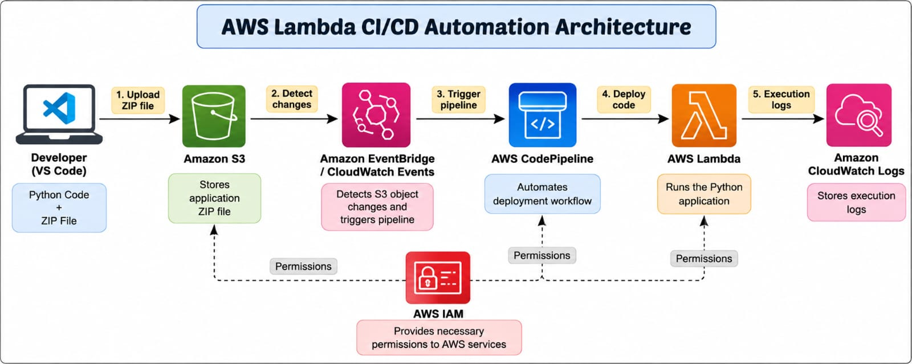
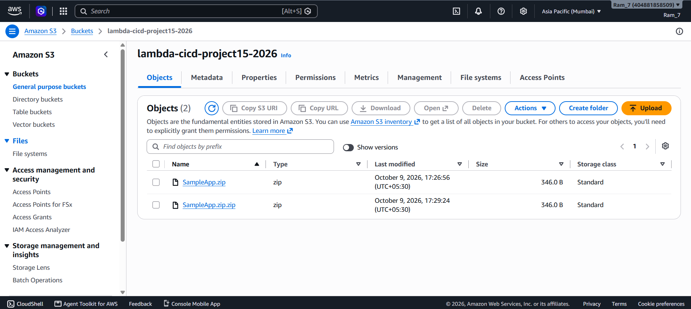
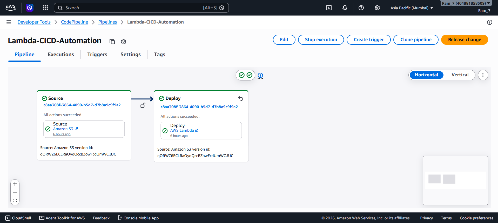
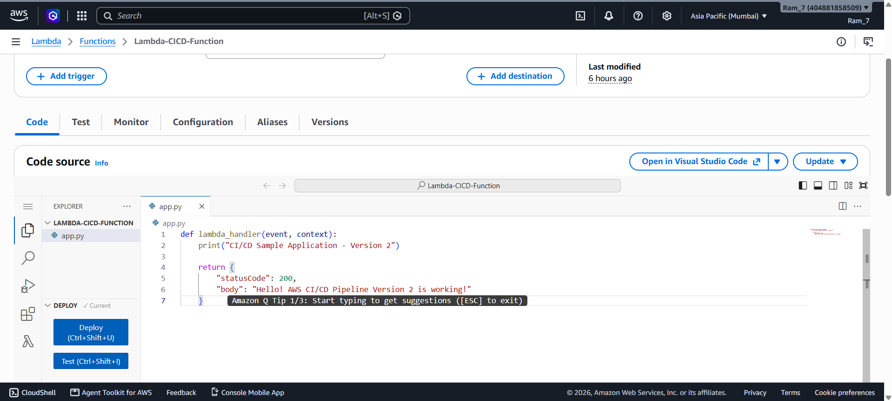
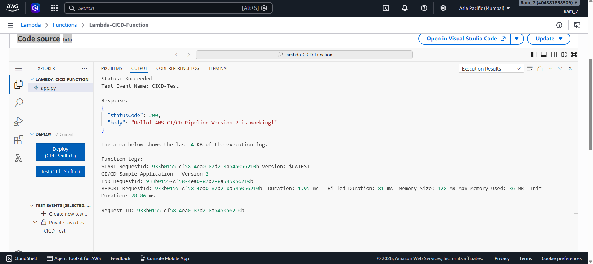
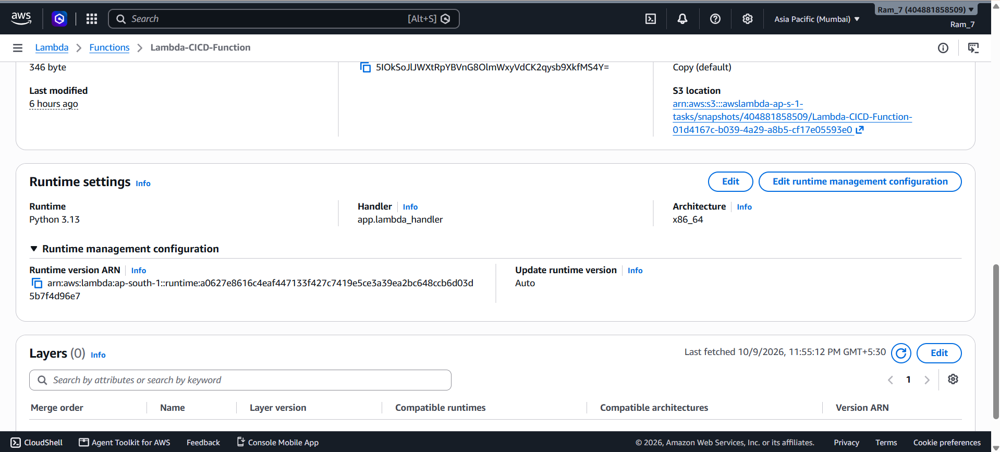

# AWS Lambda CI/CD Automation Using AWS CodePipeline

## Project Overview

This project demonstrates how to automate the deployment of an AWS Lambda function using AWS CodePipeline and Amazon S3.

Whenever a new version of the application ZIP file is uploaded to the configured S3 bucket, the CI/CD pipeline automatically detects the change and deploys the updated code to AWS Lambda.

The project successfully demonstrates automated deployment without manually uploading code to Lambda for every update.

## Project Objectives

- Automate AWS Lambda code deployment.
- Use Amazon S3 to store application source code.
- Configure AWS CodePipeline for continuous deployment.
- Automatically detect application updates.
- Test the deployed Lambda function.
- Monitor deployment status and execution results.

## AWS Services Used

| AWS Service | Purpose |
|---|---|
| Amazon S3 | Stores the application ZIP file |
| AWS CodePipeline | Automates the deployment workflow |
| AWS Lambda | Executes the Python application |
| Amazon EventBridge | Detects S3 object changes and triggers the pipeline |
| AWS IAM | Manages access permissions and service roles |
| Amazon CloudWatch | Provides Lambda execution logs and monitoring |

## Architecture



### Architecture Workflow

1. The developer writes Python application code in VS Code.
2. The application is packaged into a ZIP file.
3. The ZIP file is uploaded to Amazon S3.
4. The configured S3 change detection triggers AWS CodePipeline.
5. CodePipeline retrieves the updated source artifact.
6. The Deploy stage automatically updates the AWS Lambda function.
7. The updated Lambda function is tested.
8. Amazon CloudWatch records execution logs.

### CI/CD Workflow

```text
Developer
    |
    v
VS Code (app.py)
    |
    v
ZIP Application
    |
    v
Amazon S3
    |
    v
Amazon EventBridge
    |
    v
AWS CodePipeline
    |
    v
AWS Lambda
    |
    v
Testing and CloudWatch Logs
```

## AWS Resource Configuration

**AWS Region:** ap-south-1 (Mumbai)

**S3 Bucket Name:**
`lambda-cicd-project15-2026`

**CodePipeline Name:**
`Lambda-CICD-Automation`

**Lambda Function Name:**
`Lambda-CICD-Function`

**Runtime:** Python 3.13

**Lambda Handler:** `app.lambda_handler`

## Project Structure

```text
Lambda-CICD-App/
|
|-- app.py
|-- README.md
|-- architecture.md
|-- SampleApp.zip
|
|-- images/
    |-- 01-s3.png
    |-- 02-cp.png
    |-- 03-lcode.png
    |-- 04-lresult.png
    |-- 05-lambda-config.png
    |-- architecture.png
```

## Application Source Code

File: `app.py`

```python
def lambda_handler(event, context):
    print("CI/CD Sample Application - Version 2")

    return {
        "statusCode": 200,
        "body": "Hello! AWS CI/CD Pipeline Version 2 is working!"
    }
```

## Implementation Steps

### Step 1: Create Amazon S3 Bucket

Created an S3 bucket to store the Lambda application ZIP file.

Bucket name: `lambda-cicd-project15-2026`

### Step 2: Create Lambda Function

Created an AWS Lambda function using Python runtime.

Function name: `Lambda-CICD-Function`

### Step 3: Create CodePipeline

Created a pipeline named `Lambda-CICD-Automation`.

Configured the following stages:

- Source: Amazon S3
- Deploy: AWS Lambda

The Build and Test stages were skipped because this sample Python application did not require a separate build process.

### Step 4: Configure Automatic Deployment

Configured S3 change detection so that uploading an updated application ZIP file starts the deployment pipeline.

### Step 5: Update Application Code

Updated the application from Version 1 to Version 2.

Created a new ZIP package and uploaded it to the configured S3 object key.

### Step 6: Verify Pipeline

AWS CodePipeline successfully completed both stages:

- Source: Succeeded
- Deploy: Succeeded

### Step 7: Test AWS Lambda

Executed the updated Lambda function using the saved test event `CICD-Test`.

The function returned a successful response.

## Project Screenshots

### 1. Amazon S3 Bucket

This screenshot shows the S3 bucket used to store the Lambda deployment package.



### 2. AWS CodePipeline Successful Deployment

This screenshot shows the Source and Deploy stages successfully completed.



### 3. AWS Lambda Application Code

This screenshot shows the Python application deployed to AWS Lambda.



### 4. AWS Lambda Execution Result

This screenshot shows the successful execution of Version 2.



### 5. AWS Lambda Configuration

This screenshot shows the configuration of the AWS Lambda function.



## Test Results

**Test Event:** `CICD-Test`

**Execution Status:** Succeeded

**HTTP Status Code:** 200

**Response:**

```json
{
  "statusCode": 200,
  "body": "Hello! AWS CI/CD Pipeline Version 2 is working!"
}
```

**Execution Log:**

```text
CI/CD Sample Application - Version 2
```

The result confirms that the updated application code was deployed and executed successfully.

## Security Configuration

- AWS IAM roles are used to provide permissions to CodePipeline and Lambda.
- The Lambda function uses an execution role.
- CodePipeline uses a service role to access the required AWS resources.
- Amazon S3 stores the deployment package.
- IAM permissions should follow the principle of least privilege.
- Sensitive credentials should not be stored in source code or uploaded to GitHub.

## Failure Handling

If the deployment fails:

1. Check the failed stage in AWS CodePipeline.
2. Review the deployment error message.
3. Verify the S3 object key and ZIP package.
4. Check CodePipeline IAM permissions.
5. Verify the Lambda function name and runtime configuration.
6. Review AWS CloudWatch logs for function execution errors.
7. Fix the issue and upload a corrected application package.

## Why These AWS Services Were Selected

**Amazon S3:** Provides durable storage for deployment packages.

**AWS CodePipeline:** Automates the deployment process and tracks deployment status.

**AWS Lambda:** Runs the Python application without managing servers.

**Amazon EventBridge:** Supports automatic pipeline triggering when source changes are detected.

**AWS IAM:** Controls access to AWS resources.

**Amazon CloudWatch:** Helps monitor execution and troubleshoot failures.

## Production Improvements

The following improvements can be added for a production environment:

- Add AWS CodeBuild for automated build and validation.
- Add automated unit tests.
- Configure CloudWatch alarms.
- Add deployment approval stages where required.
- Use Lambda versions and aliases for safer deployments.
- Configure rollback strategies.
- Improve IAM permissions and security controls.
- Integrate GitHub as a source repository for code changes.

## Project Outcome

The CI/CD pipeline successfully automated the deployment of the Python application from Amazon S3 to AWS Lambda.

The updated Version 2 application was deployed and tested successfully.

This project demonstrates practical experience with AWS Lambda, Amazon S3, AWS CodePipeline, IAM, EventBridge, and CloudWatch.

## Conclusion

This project helped me understand how CI/CD automation works using AWS services.

I learned how to configure an automated deployment pipeline, update application code, deploy it to AWS Lambda, and verify successful execution.

The project provides a foundation for implementing CI/CD workflows in real-world cloud applications.