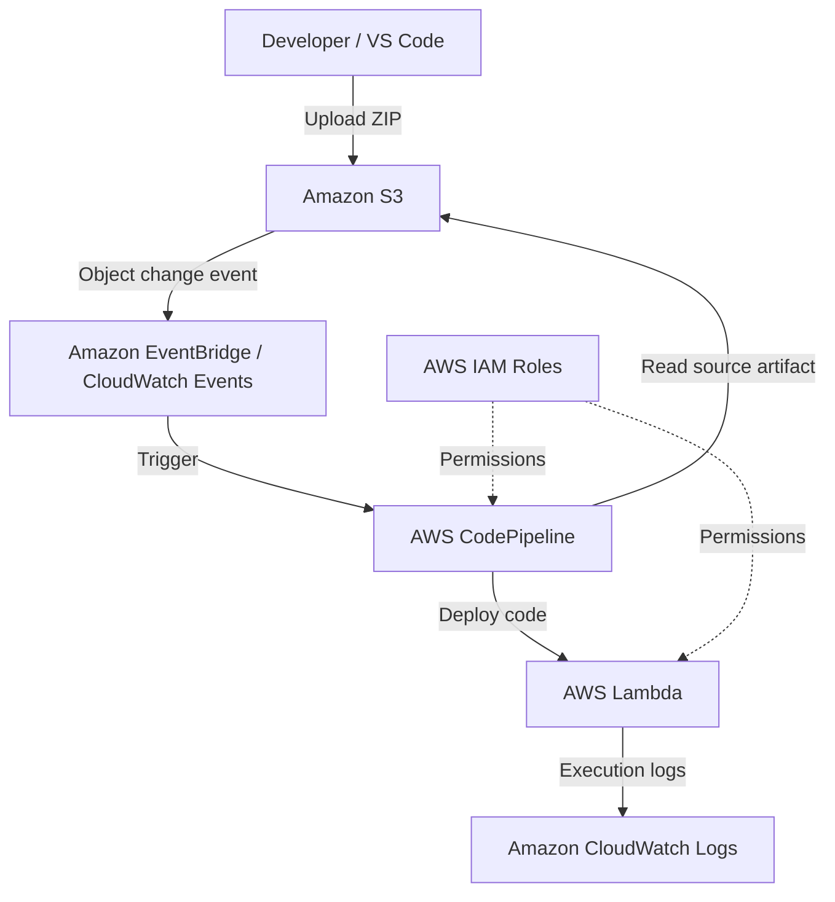

# AWS Lambda CI/CD Automation - Architecture

```mermaid
flowchart TD
    A["Developer / VS Code"] -->|"Upload ZIP"| B["Amazon S3"]
    B -->|"Object change event"| C["Amazon EventBridge / CloudWatch Events"]
    C -->|"Trigger"| D["AWS CodePipeline"]
    D -->|"Read source artifact"| B
    D -->|"Deploy code"| E["AWS Lambda"]
    E -->|"Execution logs"| F["Amazon CloudWatch Logs"]
    G["AWS IAM Roles"] -.->|"Permissions"| D
    G -.->|"Permissions"| E
```